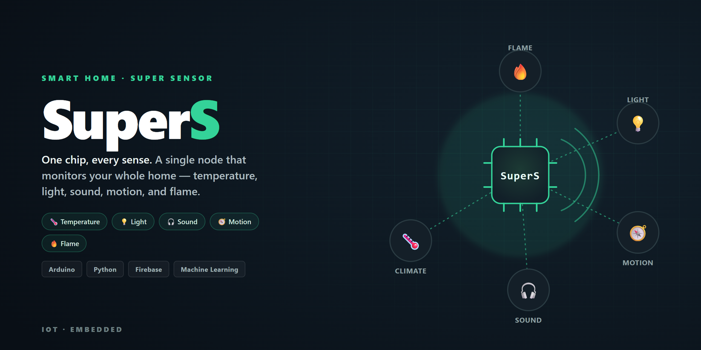

<div align="center">



# SuperS

**One chip, every sense** — a smart-home "super sensor" that monitors a whole room from a single node: temperature, light, sound, motion, and flame.


</div>

## Overview

SuperS is driven by the idea of a **smart home** — a house equipped with lighting, heating, and
electronic devices that can be controlled remotely from a phone or computer. To make that real,
a home needs sensors in every room.

That's the **super sensor**: a single small chip that combines many sensors. Place one in each
room to cover the whole house, and you can monitor its status — temperature, light, the number of
people present, and more — and even control electronics (turn a device on or off) from the mobile app.

## Hardware

| Sensor | What it measures |
| --- | --- |
| **BME280** | Temperature, humidity, and barometric pressure |
| **TSL2561** | Ambient light (lux) |
| **SPH0645** | Sound (I²S MEMS microphone) |
| **LSM9DS1** | Motion — accelerometer, gyroscope, magnetometer |
| **Flame sensor** | Fire / flame detection |

## How it works

**1. Machine learning**
- Collect data from the sensors.
- Store the labeled dataset.
- Train a model on the data set.

**2. Monitoring**
- Collect live data from the sensors.
- Store it in **Firebase**.
- Display the home's status in the **mobile app**.

## Repository layout

```text
Ai.py                 # model / inference
data.py, exal.py      # data handling
collacting_data/      # data-collection sketches (+ buttons)
bme280/               # climate sensor
tsl2561/              # light sensor
sph0645/              # microphone
LSM9DS1/              # motion (IMU)
flameSensor/          # flame detection
final/                # combined firmware
```

Each sensor folder contains its Arduino sketch (`.ino`); the Python files handle data collection,
storage, and the machine-learning side.

---

<div align="center"><sub>A smart-home IoT project · Arduino · Python · Firebase</sub></div>
